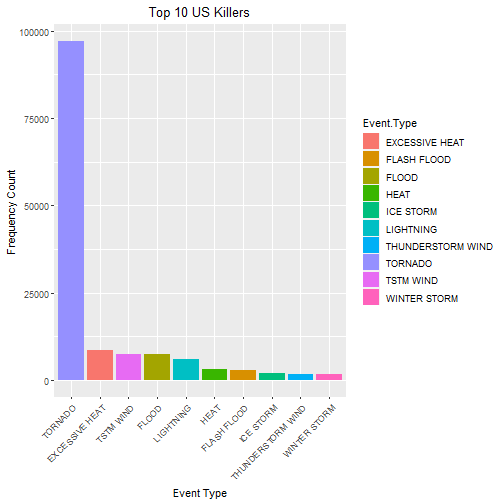
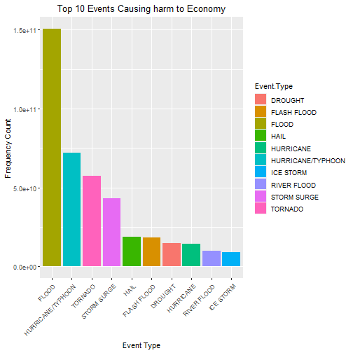

# 1 Synopsis : 

The goal of the project is to explore the NOAA Storm Dataset and analyze the impact of storms on US economy and health.
The dataset covers the time prios between 1950 and November 2011.

Health Impact from Storms - Tornado is the biggest contributor to fatalities contributing nearly 100k injuries or deaths. Other events contribution small in comparison to tornadoes

Economic Impact from Storms - Floods and hurricanes are the biggest contributors to impact on Economy

# 2 Dataset Source and other details : 

Dataset Source : https://d396qusza40orc.cloudfront.net/repdata%2Fdata%2FStormData.csv.bz2

Other useful information about dataset:

* National Weather Service Storm Data Documentation : (https://d396qusza40orc.cloudfront.net/repdata%2Fpeer2_doc%2Fpd01016005curr.pdf)

* National Climatic Data Center Storm Events FAQ (https://d396qusza40orc.cloudfront.net/repdata%2Fpeer2_doc%2FNCDC%20Storm%20Events-FAQ%20Page.pdf)

# 3 Importing the libraries


```r
library(ggplot2)
library(reshape2)
```

# 4 Data Processing

## 4.1 Downloading the data and loading into R


```r
fileUrl <- "https://d396qusza40orc.cloudfront.net/repdata%2Fdata%2FStormData.csv.bz2"
download.file(fileUrl, destfile = paste0("/Users/jnrah/Downloads", '/repdata%2Fdata%2FStormData.csv.bz2'))
stormDF <- read.csv("/Users/jnrah/Downloads/repdata%2Fdata%2FStormData.csv.bz2",na.strings = c(""))
```

## 4.2 Data Exploration

### 4.2.1 Looking at the structure and summary of the dataset


```r
head(stormDF)
```

```
##   STATE__           BGN_DATE BGN_TIME TIME_ZONE COUNTY COUNTYNAME STATE  EVTYPE BGN_RANGE BGN_AZI BGN_LOCATI END_DATE
## 1       1  4/18/1950 0:00:00     0130       CST     97     MOBILE    AL TORNADO         0    <NA>       <NA>     <NA>
## 2       1  4/18/1950 0:00:00     0145       CST      3    BALDWIN    AL TORNADO         0    <NA>       <NA>     <NA>
## 3       1  2/20/1951 0:00:00     1600       CST     57    FAYETTE    AL TORNADO         0    <NA>       <NA>     <NA>
## 4       1   6/8/1951 0:00:00     0900       CST     89    MADISON    AL TORNADO         0    <NA>       <NA>     <NA>
## 5       1 11/15/1951 0:00:00     1500       CST     43    CULLMAN    AL TORNADO         0    <NA>       <NA>     <NA>
## 6       1 11/15/1951 0:00:00     2000       CST     77 LAUDERDALE    AL TORNADO         0    <NA>       <NA>     <NA>
##   END_TIME COUNTY_END COUNTYENDN END_RANGE END_AZI END_LOCATI LENGTH WIDTH F MAG FATALITIES INJURIES PROPDMG PROPDMGEXP
## 1     <NA>          0         NA         0    <NA>       <NA>   14.0   100 3   0          0       15    25.0          K
## 2     <NA>          0         NA         0    <NA>       <NA>    2.0   150 2   0          0        0     2.5          K
## 3     <NA>          0         NA         0    <NA>       <NA>    0.1   123 2   0          0        2    25.0          K
## 4     <NA>          0         NA         0    <NA>       <NA>    0.0   100 2   0          0        2     2.5          K
## 5     <NA>          0         NA         0    <NA>       <NA>    0.0   150 2   0          0        2     2.5          K
## 6     <NA>          0         NA         0    <NA>       <NA>    1.5   177 2   0          0        6     2.5          K
##   CROPDMG CROPDMGEXP  WFO STATEOFFIC ZONENAMES LATITUDE LONGITUDE LATITUDE_E LONGITUDE_ REMARKS REFNUM
## 1       0       <NA> <NA>       <NA>      <NA>     3040      8812       3051       8806    <NA>      1
## 2       0       <NA> <NA>       <NA>      <NA>     3042      8755          0          0    <NA>      2
## 3       0       <NA> <NA>       <NA>      <NA>     3340      8742          0          0    <NA>      3
## 4       0       <NA> <NA>       <NA>      <NA>     3458      8626          0          0    <NA>      4
## 5       0       <NA> <NA>       <NA>      <NA>     3412      8642          0          0    <NA>      5
## 6       0       <NA> <NA>       <NA>      <NA>     3450      8748          0          0    <NA>      6
```


```r
str(stormDF)
```

```
## 'data.frame':	902297 obs. of  37 variables:
##  $ STATE__   : num  1 1 1 1 1 1 1 1 1 1 ...
##  $ BGN_DATE  : chr  "4/18/1950 0:00:00" "4/18/1950 0:00:00" "2/20/1951 0:00:00" "6/8/1951 0:00:00" ...
##  $ BGN_TIME  : chr  "0130" "0145" "1600" "0900" ...
##  $ TIME_ZONE : chr  "CST" "CST" "CST" "CST" ...
##  $ COUNTY    : num  97 3 57 89 43 77 9 123 125 57 ...
##  $ COUNTYNAME: chr  "MOBILE" "BALDWIN" "FAYETTE" "MADISON" ...
##  $ STATE     : chr  "AL" "AL" "AL" "AL" ...
##  $ EVTYPE    : chr  "TORNADO" "TORNADO" "TORNADO" "TORNADO" ...
##  $ BGN_RANGE : num  0 0 0 0 0 0 0 0 0 0 ...
##  $ BGN_AZI   : chr  NA NA NA NA ...
##  $ BGN_LOCATI: chr  NA NA NA NA ...
##  $ END_DATE  : chr  NA NA NA NA ...
##  $ END_TIME  : chr  NA NA NA NA ...
##  $ COUNTY_END: num  0 0 0 0 0 0 0 0 0 0 ...
##  $ COUNTYENDN: logi  NA NA NA NA NA NA ...
##  $ END_RANGE : num  0 0 0 0 0 0 0 0 0 0 ...
##  $ END_AZI   : chr  NA NA NA NA ...
##  $ END_LOCATI: chr  NA NA NA NA ...
##  $ LENGTH    : num  14 2 0.1 0 0 1.5 1.5 0 3.3 2.3 ...
##  $ WIDTH     : num  100 150 123 100 150 177 33 33 100 100 ...
##  $ F         : int  3 2 2 2 2 2 2 1 3 3 ...
##  $ MAG       : num  0 0 0 0 0 0 0 0 0 0 ...
##  $ FATALITIES: num  0 0 0 0 0 0 0 0 1 0 ...
##  $ INJURIES  : num  15 0 2 2 2 6 1 0 14 0 ...
##  $ PROPDMG   : num  25 2.5 25 2.5 2.5 2.5 2.5 2.5 25 25 ...
##  $ PROPDMGEXP: chr  "K" "K" "K" "K" ...
##  $ CROPDMG   : num  0 0 0 0 0 0 0 0 0 0 ...
##  $ CROPDMGEXP: chr  NA NA NA NA ...
##  $ WFO       : chr  NA NA NA NA ...
##  $ STATEOFFIC: chr  NA NA NA NA ...
##  $ ZONENAMES : chr  NA NA NA NA ...
##  $ LATITUDE  : num  3040 3042 3340 3458 3412 ...
##  $ LONGITUDE : num  8812 8755 8742 8626 8642 ...
##  $ LATITUDE_E: num  3051 0 0 0 0 ...
##  $ LONGITUDE_: num  8806 0 0 0 0 ...
##  $ REMARKS   : chr  NA NA NA NA ...
##  $ REFNUM    : num  1 2 3 4 5 6 7 8 9 10 ...
```


```r
summary(stormDF)
```

```
##     STATE__       BGN_DATE           BGN_TIME          TIME_ZONE             COUNTY       COUNTYNAME       
##  Min.   : 1.0   Length:902297      Length:902297      Length:902297      Min.   :  0.0   Length:902297     
##  1st Qu.:19.0   Class :character   Class :character   Class :character   1st Qu.: 31.0   Class :character  
##  Median :30.0   Mode  :character   Mode  :character   Mode  :character   Median : 75.0   Mode  :character  
##  Mean   :31.2                                                            Mean   :100.6                     
##  3rd Qu.:45.0                                                            3rd Qu.:131.0                     
##  Max.   :95.0                                                            Max.   :873.0                     
##                                                                                                            
##     STATE              EVTYPE            BGN_RANGE          BGN_AZI           BGN_LOCATI          END_DATE        
##  Length:902297      Length:902297      Min.   :   0.000   Length:902297      Length:902297      Length:902297     
##  Class :character   Class :character   1st Qu.:   0.000   Class :character   Class :character   Class :character  
##  Mode  :character   Mode  :character   Median :   0.000   Mode  :character   Mode  :character   Mode  :character  
##                                        Mean   :   1.484                                                           
##                                        3rd Qu.:   1.000                                                           
##                                        Max.   :3749.000                                                           
##                                                                                                                   
##    END_TIME           COUNTY_END COUNTYENDN       END_RANGE          END_AZI           END_LOCATI       
##  Length:902297      Min.   :0    Mode:logical   Min.   :  0.0000   Length:902297      Length:902297     
##  Class :character   1st Qu.:0    NA's:902297    1st Qu.:  0.0000   Class :character   Class :character  
##  Mode  :character   Median :0                   Median :  0.0000   Mode  :character   Mode  :character  
##                     Mean   :0                   Mean   :  0.9862                                        
##                     3rd Qu.:0                   3rd Qu.:  0.0000                                        
##                     Max.   :0                   Max.   :925.0000                                        
##                                                                                                         
##      LENGTH              WIDTH                F               MAG            FATALITIES          INJURIES        
##  Min.   :   0.0000   Min.   :   0.000   Min.   :0.0      Min.   :    0.0   Min.   :  0.0000   Min.   :   0.0000  
##  1st Qu.:   0.0000   1st Qu.:   0.000   1st Qu.:0.0      1st Qu.:    0.0   1st Qu.:  0.0000   1st Qu.:   0.0000  
##  Median :   0.0000   Median :   0.000   Median :1.0      Median :   50.0   Median :  0.0000   Median :   0.0000  
##  Mean   :   0.2301   Mean   :   7.503   Mean   :0.9      Mean   :   46.9   Mean   :  0.0168   Mean   :   0.1557  
##  3rd Qu.:   0.0000   3rd Qu.:   0.000   3rd Qu.:1.0      3rd Qu.:   75.0   3rd Qu.:  0.0000   3rd Qu.:   0.0000  
##  Max.   :2315.0000   Max.   :4400.000   Max.   :5.0      Max.   :22000.0   Max.   :583.0000   Max.   :1700.0000  
##                                         NA's   :843563                                                           
##     PROPDMG         PROPDMGEXP           CROPDMG         CROPDMGEXP            WFO             STATEOFFIC       
##  Min.   :   0.00   Length:902297      Min.   :  0.000   Length:902297      Length:902297      Length:902297     
##  1st Qu.:   0.00   Class :character   1st Qu.:  0.000   Class :character   Class :character   Class :character  
##  Median :   0.00   Mode  :character   Median :  0.000   Mode  :character   Mode  :character   Mode  :character  
##  Mean   :  12.06                      Mean   :  1.527                                                           
##  3rd Qu.:   0.50                      3rd Qu.:  0.000                                                           
##  Max.   :5000.00                      Max.   :990.000                                                           
##                                                                                                                 
##   ZONENAMES            LATITUDE      LONGITUDE        LATITUDE_E     LONGITUDE_       REMARKS              REFNUM      
##  Length:902297      Min.   :   0   Min.   :-14451   Min.   :   0   Min.   :-14455   Length:902297      Min.   :     1  
##  Class :character   1st Qu.:2802   1st Qu.:  7247   1st Qu.:   0   1st Qu.:     0   Class :character   1st Qu.:225575  
##  Mode  :character   Median :3540   Median :  8707   Median :   0   Median :     0   Mode  :character   Median :451149  
##                     Mean   :2875   Mean   :  6940   Mean   :1452   Mean   :  3509                      Mean   :451149  
##                     3rd Qu.:4019   3rd Qu.:  9605   3rd Qu.:3549   3rd Qu.:  8735                      3rd Qu.:676723  
##                     Max.   :9706   Max.   : 17124   Max.   :9706   Max.   :106220                      Max.   :902297  
##                     NA's   :47                      NA's   :40
```

### 4.2.2 Looking at the amount of missing values in the data


```r
sapply(stormDF,function(y) sum(length(which(is.na(y)))))
```

```
##    STATE__   BGN_DATE   BGN_TIME  TIME_ZONE     COUNTY COUNTYNAME      STATE     EVTYPE  BGN_RANGE    BGN_AZI BGN_LOCATI 
##          0          0          0          0          0       1589          0          0          0     547332     287743 
##   END_DATE   END_TIME COUNTY_END COUNTYENDN  END_RANGE    END_AZI END_LOCATI     LENGTH      WIDTH          F        MAG 
##     243411     238978          0     902297          0     724837     499225          0          0     843563          0 
## FATALITIES   INJURIES    PROPDMG PROPDMGEXP    CROPDMG CROPDMGEXP        WFO STATEOFFIC  ZONENAMES   LATITUDE  LONGITUDE 
##          0          0          0     465934          0     618413     142069     248769     594029         47          0 
## LATITUDE_E LONGITUDE_    REMARKS     REFNUM 
##         40          0     287433          0
```

There are 37 variables in the data. Since we only need to examine health and economic impacts of storms on US, we
can remove the variables which are not required for the analysis.

## 4.3 Data Subsetting

### 4.3.1 Only keeping variables useful for analysis


```r
col2keep <- c('BGN_DATE','EVTYPE','FATALITIES','INJURIES','PROPDMG','PROPDMGEXP','CROPDMG','CROPDMGEXP')
stormDF_sub <- stormDF[,col2keep]
stormDF_sub <- subset(stormDF_sub,EVTYPE != "?")
stormDF_sub$BGN_DATE <- as.Date(stormDF_sub$BGN_DATE,"%m/%d/%Y")
```

### 4.3.2 Subsetting data to create 2 different dataframes, one for analyzing health impact and other for economic impact


```r
stormDF_health <- stormDF[,c('BGN_DATE','EVTYPE','FATALITIES','INJURIES')]
stormDF_health <- subset(stormDF_health,FATALITIES > 0 | INJURIES > 0)
```


```r
stormDF_eco <- stormDF[,c('BGN_DATE','EVTYPE','PROPDMG','PROPDMGEXP','CROPDMG','CROPDMGEXP')]
stormDF_eco <- subset(stormDF_eco,PROPDMG > 0 | CROPDMG > 0)
```

### 4.3.3 Converting columns in stormDF_eco from exponent to numeric values


```r
cropDmgKey <- c("?" = 10^0,"0" = 10^0,"K"=10^3,"M"=10^6,"B"=10^9)
stormDF_eco$CROPDMGEXP <- as.character(stormDF_eco$CROPDMGEXP)
stormDF_eco$CROPDMGEXP <- toupper(stormDF_eco$CROPDMGEXP)
stormDF_eco$CROPDMGEXP <- cropDmgKey[stormDF_eco$CROPDMGEXP]
stormDF_eco$CROPDMGEXP[is.na(stormDF_eco$CROPDMGEXP)] <- 1
```


```r
propDmgKey <- c("?" = 1,"-"=1,"+"=1,"0" = 1,"2"=10^2,"3"=10^3,"4"=10^4,"5"=10^5,
                "6"=10^6,"7"=10^7,"H"=10^6,
                "K"=10^3,"M"=10^6,"B"=10^9)
stormDF_eco$PROPDMGEXP <- as.character(stormDF_eco$PROPDMGEXP)
stormDF_eco$PROPDMGEXP <- toupper(stormDF_eco$PROPDMGEXP)
stormDF_eco$PROPDMGEXP <- propDmgKey[stormDF_eco$PROPDMGEXP]
stormDF_eco$PROPDMGEXP[is.na(stormDF_eco$PROPDMGEXP)] <- 1
```


### 4.3.4 Making Economic Cost Columns


```r
stormDF_eco$prop.cost <- stormDF_eco$PROPDMGEXP * stormDF_eco$PROPDMG
stormDF_eco$crop.cost <- stormDF_eco$CROPDMGEXP * stormDF_eco$CROPDMG
stormDF_eco$total.cost <- stormDF_eco$prop.cost + stormDF_eco$crop.cost
```

### 4.3.5 Making Health Cost Columns


```r
stormDF_health$total_fatal <- stormDF_health$FATALITIES + stormDF_health$INJURIES
```

## 4.4 Creating summary dataframes for visualization

### 4.4.1 Economic Cost Dataframe


```r
totalCost <- aggregate(stormDF_eco$total.cost~stormDF_eco$EVTYPE,FUN = sum)
names(totalCost) <- c("Event.Type","Total.Economic.Cost")
```

### 4.4.2 Health Cost Dataframe


```r
healthCost <- aggregate(stormDF_health$total_fatal~stormDF_health$EVTYPE,FUN = sum)
names(healthCost) <- c("Event.Type","Total.Health.Cost")
```

#5 Results

## 5.1 Analyzing Health Cost


```r
healthCost <- healthCost[order(-healthCost$Total.Health.Cost),]
top10_healthCost <- head(healthCost,10)
g1 <- ggplot(top10_healthCost,aes(reorder(Event.Type,-Total.Health.Cost),Total.Health.Cost))
g1 + geom_bar(stat = "identity",aes(fill=Event.Type),position = "dodge") + ylab("Frequency Count")  +
    xlab("Event Type") + theme(axis.text.x = element_text(angle=45, hjust=1)) +
    ggtitle("Top 10 US Killers") + theme(plot.title = element_text(hjust = 0.5))
```



## 5.2 Analyzing Economic Cost


```r
ecoCost <- totalCost[order(-totalCost$Total.Economic.Cost),]
top10_ecoCost <- head(ecoCost,10)
g2 <- ggplot(top10_ecoCost,aes(reorder(Event.Type,-Total.Economic.Cost),Total.Economic.Cost))
g2 + geom_bar(stat = "identity",aes(fill=Event.Type),position = "dodge") + ylab("Frequency Count")  +
    xlab("Event Type") + theme(axis.text.x = element_text(angle=45, hjust=1)) +
    ggtitle("Top 10 Events Causing harm to Economy") + theme(plot.title = element_text(hjust = 0.5))
```


